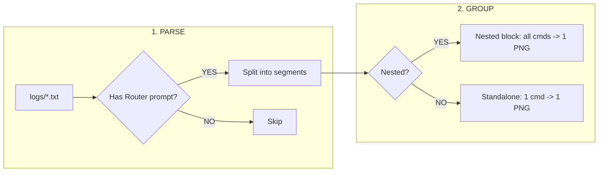

# How to Create Codebase Flowcharts

Two methods — Mermaid (quick) and Draw.io YAML (editable).

## Method 1: Mermaid (fast, renders in GitHub/Obsidian)

**Step 1**: Write Mermaid syntax in a markdown code block:



**Step 2**: Render to PNG/SVG via Playwright:
```python
from playwright.sync_api import sync_playwright
with sync_playwright() as p:
    browser = p.chromium.launch(headless=True)
    page = browser.new_page(viewport={'width': 1600, 'height': 1200})
    page.goto('file:///path/to/flowchart.html')
    page.wait_for_timeout(3000)
    page.screenshot(path='flowchart.png', full_page=True)
    svg = page.locator('svg').first.inner_html()
    with open('flowchart.svg', 'w') as f:
        f.write(f'<?xml version="1.0"?><svg xmlns="http://www.w3.org/2000/svg">{svg}</svg>')
    browser.close()
```

**Mermaid CDN** (in HTML wrapper):
```html
<script src="https://cdn.jsdelivr.net/npm/mermaid@10/dist/mermaid.min.js"></script>
<script>mermaid.initialize({startOnLoad:true, theme:'dark'});</script>
```

**Node shapes**: `[rectangle]`, `{diamond}`, `(rounded)`, `[[subroutine]]`, `[(database)]`
**Arrows**: `-->` (solid), `-.->` (dotted), `==>` (thick), `--label-->` (with text)

## Method 2: Draw.io YAML (editable, native .drawio)

**Prerequisites**: Install drawio skill:
```bash
npx skills add bahayonghang/drawio-skills@drawio -g -y
```

**Step 1**: Write YAML spec (`pipeline.spec.yaml`):

```yaml
meta:
  profile: default
  theme: dark
  layout: horizontal
  canvas: "1800x950"
  title: "Your Diagram Title"

modules:
  - id: phase1
    label: "PHASE NAME"
    style:
      fillColor: "#1a1a2e"
      strokeColor: "#e94560"
      strokeWidth: 2
      labelFontColor: "#e94560"
      labelFontWeight: 700

nodes:
  - id: node-1
    label: "Process step"
    type: process
    module: phase1
    size: medium
    position: { x: 200, y: 100 }
    style:
      fillColor: "#1a1a2e"
      strokeColor: "#e94560"
      fontColor: "#f1f5f9"

  - id: node-2
    label: "Decision?"
    type: decision
    module: phase1
    size: medium
    position: { x: 200, y: 220 }

edges:
  - from: node-1
    to: node-2
    type: primary
    label: "YES"
    style:
      strokeColor: "#e94560"
      strokeWidth: 2
```

**Step 2**: Run CLI:
```bash
node C:\Users\kacha\.agents\skills\drawio\scripts\cli.js pipeline.spec.yaml output.drawio --validate --write-sidecars
```

**Outputs**: `output.drawio`, `output.spec.yaml`, `output.arch.json`

**Node types**: `process` (rectangle), `decision` (diamond), `terminal` (rounded), `document` (wavy)
**Edge types**: `primary` (solid), `optional` (dashed), `implementation` (dotted)
**Size values**: `small`, `medium`, `large`

## Pipeline Node Map (for reference)

Phase 1 - PARSE (#1a1a2e / #e94560):
  logs/*.txt -> Has prompt? -> YES: Split -> NO: Skip -> segments list

Phase 2 - GROUP (#16213e / #0f3460):
  Deeper? -> YES: Nested block -> EOF? -> YES: Truncate / NO: Full block
         -> NO: Standalone

Phase 3 - RENDER (#0f3460 / #533483):
  Jinja2 -> Playwright -> Screenshot -> PNG (linear, no branching)

Phase 4 - INSERT (#533483 / #e94560):
  Read DOCX -> Block type? -> NESTED/POOL/USERNAME -> Found match? -> YES: Insert / NO: Skip

## Tips

- Mermaid for quick drafts, GitHub READMEs, Obsidian
- Draw.io YAML for editable diagrams, complex layouts, team handoff
- Both support dark theme
- Playwright for rendering Mermaid to PNG/SVG without manual export
- Draw.io CLI validates YAML before rendering
- Open .drawio in draw.io Desktop or https://app.diagrams.net
